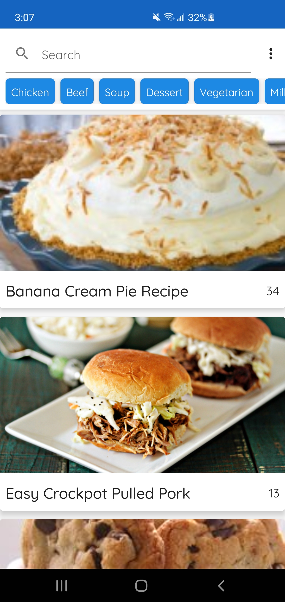
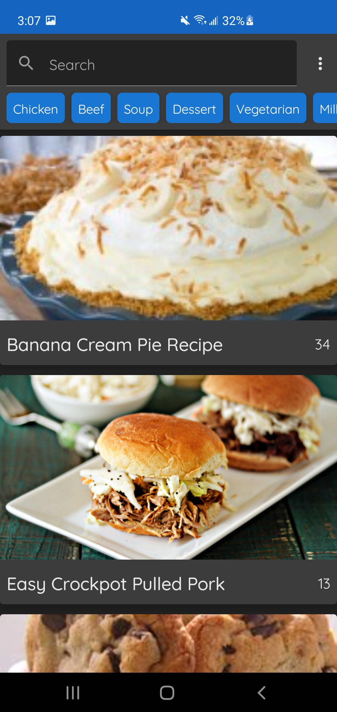
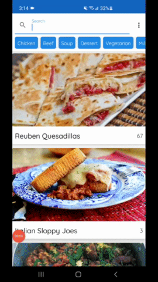
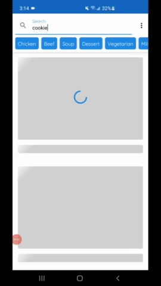
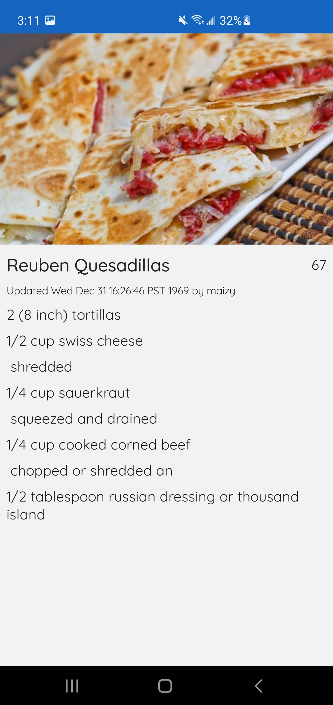
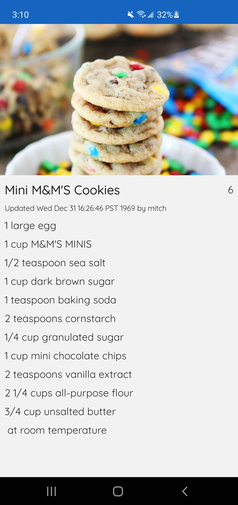

# :hamburger:Food Recipes:pizza:
Food Recipes is an android application that will allow users to browse a variety of recipes.

This application includes:
- Search bar to find a specific recipe:heavy_check_mark:
- Option to view a recipes details:heavy_check_mark:
- Option to change the applications theme:heavy_check_mark:
## Motivation
The purpose of this application is to demonstrate my android development skills.
This application consists of libraries and best practices such as:
  1. Jetpack Compose:heavy_check_mark:
  2. MVVM/MVI architecture (clean architecture):heavy_check_mark:
  3. Retrofit(+ GSON):heavy_check_mark:
  4. Dagger Hilt:heavy_check_mark:
  5. Room (local database):heavy_check_mark:
  6. Unit testing (with Junit 5 and Mockweb server):heavy_check_mark:
  7. Android Jetpack (DataStore, WorkManager):heavy_check_mark:
## :camera:Screenshots:camera:

Users will have the option to change the apps theme with a single button click

  
  

Users can simply click one of the common categories listed or search for a recipe from the search bar

  
  

Users can view the details regarding a recipe

  
  

## Framework
**Built with**
- [Jetpack Compose](https://developer.android.com/jetpack/compose)
- [Retrofit](https://square.github.io/retrofit/)
- [Dagger-Hilt](https://developer.android.com/training/dependency-injection/hilt-android)
- [Room](https://developer.android.com/training/data-storage/room)
- [Junit 5](https://github.com/mannodermaus/android-junit5)
- [Android Jetpack](https://developer.android.com/jetpack)
- [Connectivity Manager](https://developer.android.com/guide/topics/connectivity)
- [Gson](https://github.com/square/retrofit/tree/master/retrofit-converters/gson)
- [MockwebServer](https://github.com/square/okhttp/tree/master/mockwebserver)

## API Reference
- [Food2Fork](https://food2fork.ca/):computer:

## License
    Copyright 2021 Daniel Toriz Valdovinos
